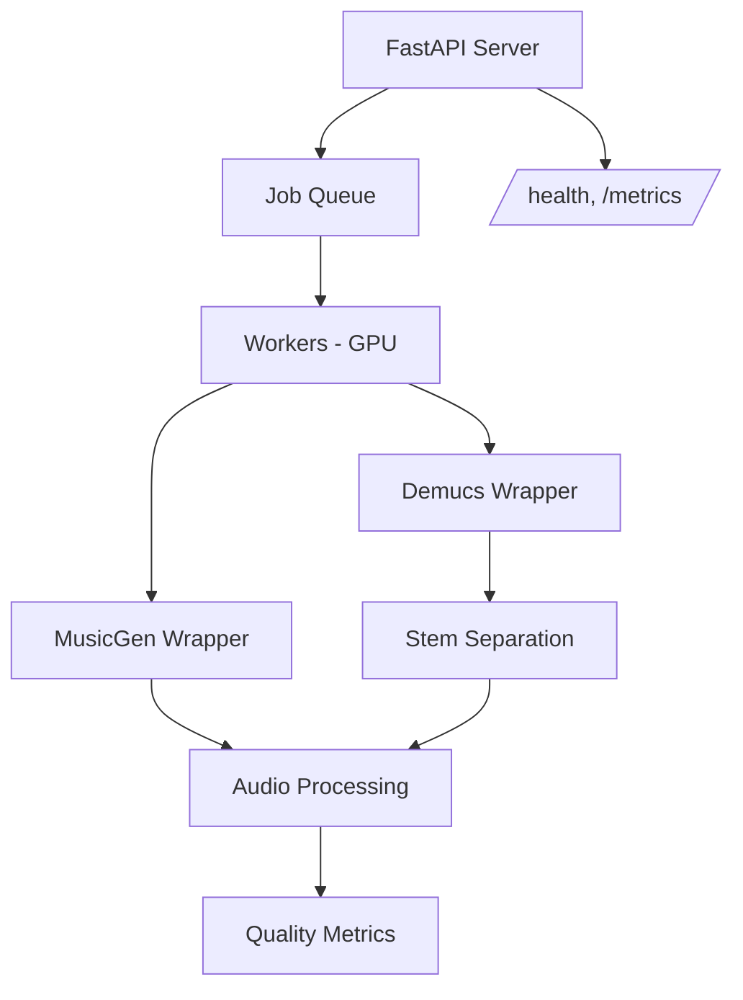
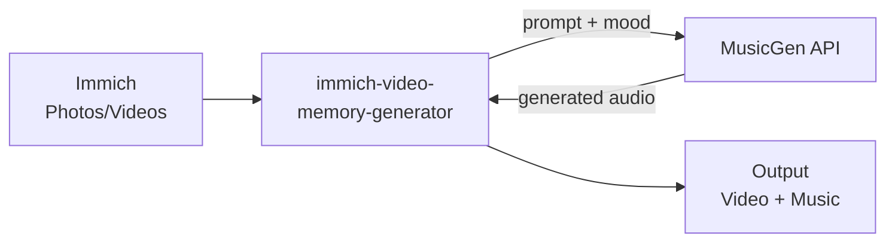

# MusicGen + Demucs API

REST API for AI music generation and audio stem separation. Uses Meta's [MusicGen](https://github.com/facebookresearch/audiocraft) to generate music from text prompts and [Demucs](https://github.com/facebookresearch/demucs) to split audio into stems. Built with FastAPI, runs on GPU or CPU.

[](https://github.com/sam-dumont/musicgen-api/actions/workflows/ci.yaml)
[](https://github.com/sam-dumont/musicgen-api/actions/workflows/release.yaml)
[](LICENSE)

> I built this as the music backend for [immich-video-memory-generator](https://github.com/sam-dumont/immich-video-memory-generator): it generates background soundtracks for Immich photo/video memories. Works as a standalone API too.

---

## Demo Samples

These 60-second tracks were generated using the `/generate/soundtrack` endpoint with `musicgen-medium` (1.5B parameters) on a single GPU. Each uses two scenes with contrasting moods, crossfaded via the quality loop.

| Sample | Prompt | Scenes |
|--------|--------|--------|
| [Acoustic Nostalgic](demos/acoustic-nostalgic.mp3) | warm acoustic guitar with soft piano, gentle and nostalgic | upbeat warm groovy → upbeat warm hopeful |
| [Electronic EBM](demos/electronic-ebm.mp3) | dark electronic body music, heavy synthesizers, mechanical beats, industrial dance, cold wave | upbeat dark driving → upbeat dark pulsing |
| [Cinematic Orchestral](demos/cinematic-orchestral.mp3) | cinematic orchestral soundtrack with sweeping strings, brass, and full orchestra, epic and emotional | upbeat bold powerful → upbeat triumphant epic |

> **Tip for best results:** The base prompt anchors the style while scene moods control the energy. Bigger mood contrasts are possible but subtler shifts (e.g. "driving energetic" → "intense groovy") produce the smoothest transitions. This is how [immich-video-memory-generator](https://github.com/sam-dumont/immich-video-memory-generator) uses this API: all moods are forced to be upbeat with only small variations in flavor.

> **Note:** GitHub doesn't embed audio players in markdown — click the links to download and listen, or clone the repo.

---

## Features

### Music Generation
- **Text-to-Music**: generate music from natural language descriptions
- **Multiple Moods**: multi-scene soundtracks with mood transitions
- **Configurable Quality**: small (300M), medium (1.5B), or large (3.3B) models
- **Long-form Generation**: tracks from 10 seconds to 10+ minutes via sliding window generation with crossfaded segments

### Audio Processing Pipeline
- **Equal-Power Crossfading**: constant perceived loudness during transitions (no volume dip)
- **Beat-Aligned Transitions**: cuts snap to musical beats
- **Zero-Crossing Snapping**: no clicks or pops at edit points
- **Stem-Aware Crossfading**: Demucs separates drums, bass, and melody for independent crossfade handling
- **Tempo Matching**: consistent BPM across segments
- **Quality Loop**: auto-regenerates poor transitions based on spectral metrics

### Stem Separation
- **Demucs Integration**: audio source separation via Meta's Demucs
- **Two-Stem Mode**: vocals + accompaniment
- **Four-Stem Mode**: drums, bass, other, vocals

---

## Quick Start

Docker Compose with a GPU:

```bash
git clone https://github.com/sam-dumont/musicgen-api.git
cd musicgen-api
cp .env.example .env  # set API_KEY and model

docker compose up -d

curl -X POST http://localhost:8000/generate \
  -H "Content-Type: application/json" \
  -H "X-API-Key: your-api-key" \
  -d '{"prompt": "gentle acoustic guitar", "duration": 30}'
```

No GPU? CPU works too (just slower):
```bash
docker compose -f docker-compose.yml -f docker-compose.cpu.yml up -d
```

### Resource Requirements

| Model | Parameters | VRAM | Memory | Storage |
|-------|------------|------|--------|---------|
| `musicgen-small` | 300M | ~4GB | 6GB | 15GB |
| `musicgen-medium` | 1.5B | ~8-12GB | 10GB | 15GB |
| `musicgen-large` | 3.3B | ~16GB+ | 16GB | 15GB |

---

## API Reference

### Endpoints

| Endpoint | Method | Description |
|----------|--------|-------------|
| `/health` | GET | Health check (liveness/readiness probe) |
| `/generate` | POST | Generate music from text prompt |
| `/generate/soundtrack` | POST | Generate multi-scene soundtrack |
| `/separate` | POST | Separate audio into stems |
| `/jobs/{job_id}` | GET | Check job status |
| `/files/{filename}` | GET | Download generated files |
| `/metrics` | GET | Prometheus metrics |
| `/metrics/json` | GET | JSON metrics |

### Generate Music

```bash
curl -X POST http://localhost:8000/generate \
  -H "Content-Type: application/json" \
  -H "X-API-Key: your-api-key" \
  -d '{
    "prompt": "gentle acoustic guitar music for family memories",
    "duration": 60,
    "mood": "nostalgic and warm"
  }'
```

### Generate Soundtrack (Multi-Scene)

Multiple moods in one track, crossfaded together:

```bash
curl -X POST http://localhost:8000/generate/soundtrack \
  -H "Content-Type: application/json" \
  -H "X-API-Key: your-api-key" \
  -d '{
    "base_prompt": "cinematic orchestral music",
    "scenes": [
      {"mood": "peaceful morning", "duration": 20},
      {"mood": "joyful celebration", "duration": 25},
      {"mood": "gentle farewell", "duration": 15}
    ],
    "crossfade_duration": 2.0
  }'
```

### Check Job Status

```bash
curl http://localhost:8000/jobs/{job_id}

# Response:
{
  "job_id": "abc123",
  "status": "completed",
  "progress": 100.0,
  "result_urls": ["/files/abc123_generated.wav"],
  "error": null
}
```

---

## Configuration

### Environment Variables

| Variable | Description | Default |
|----------|-------------|---------|
| `API_KEY` | API key for authentication | (none: auth disabled) |
| `OUTPUT_DIR` | Directory for output files | `/data/output` |
| `MUSICGEN_MODEL` | Model to use | `facebook/musicgen-medium` |
| `USE_STEM_AWARE_CROSSFADE` | Enable Demucs-based transitions | `true` |
| `USE_QUALITY_LOOP` | Enable auto-regeneration | `true` |
| `MAX_REGEN_ATTEMPTS` | Max regeneration attempts | `3` |
| `PYTORCH_CUDA_ALLOC_CONF` | CUDA memory config | `expandable_segments:True` |

### Model Selection Guide

| Model | Parameters | VRAM | Quality | Speed | Use Case |
|-------|------------|------|---------|-------|----------|
| `musicgen-small` | 300M | ~4GB | Good | Fast | Development, low-end GPUs |
| `musicgen-medium` | 1.5B | ~8-12GB | Better | Medium | **Recommended for production** |
| `musicgen-large` | 3.3B | ~16GB+ | Best | Slow | Highest quality, high-end GPUs |

---

## Self-Hosting Guide

### Docker Compose

Copy `.env.example` to `.env`, set your `API_KEY` and model, then:

```bash
# GPU
docker compose up -d

# CPU-only (no GPU required, just slower)
docker compose -f docker-compose.yml -f docker-compose.cpu.yml up -d
```

### Kubernetes

Kubernetes manifests in [`deploy/kubernetes/`](deploy/kubernetes/):

```bash
# Review and customize the manifests first
kubectl apply -k deploy/kubernetes/
```

You'll want to:
- Set your storage class in `pvc.yaml`
- Update the API key in `secret.yaml`
- Configure the ingress domain in `ingress.yaml`

### Terraform

Reusable Terraform module in [`deploy/terraform/`](deploy/terraform/). See the [module README](deploy/terraform/README.md) for inputs/outputs.

```hcl
module "musicgen" {
  source = "./modules/musicgen-api"

  musicgen_model = "facebook/musicgen-medium"
  gpu_enabled    = true
  domain         = "musicgen.example.com"
  storage_class  = "standard"
}
```

### Building from Source

```bash
docker build -t musicgen-api .

docker run --gpus all -p 8000:8000 \
  -e API_KEY=your-secret-key \
  -e MUSICGEN_MODEL=facebook/musicgen-medium \
  -v /path/to/cache:/home/appuser/.cache \
  -v /path/to/output:/data/output \
  musicgen-api
```

Or run directly with Python:

```bash
make dev       # Install dependencies (requires uv)
make run       # Start the server
```

### Health Checks

```bash
curl http://localhost:8000/health
# Check GPU detection:
curl http://localhost:8000/health | jq '.device'
# Expected: "cuda" for NVIDIA GPU
```

---

## Architecture



### Component Overview

| Component | File | Purpose |
|-----------|------|---------|
| FastAPI Server | `app/main.py` | HTTP endpoints, authentication |
| Job Queue | `app/job_queue.py` | Async background processing |
| MusicGen Wrapper | `app/musicgen.py` | Model loading, generation, crossfading |
| Soundtrack Generator | `app/soundtrack.py` | Multi-scene music composition |
| Audio Processing | `app/audio_processing.py` | Stem crossfade, tempo matching |
| Quality Metrics | `app/quality_metrics.py` | Transition evaluation, regeneration |
| Demucs Wrapper | `app/demucs_runner.py` | Stem separation |

---

## Integration with immich-video-memory-generator

This API is the music backend for [immich-video-memory-generator](https://github.com/sam-dumont/immich-video-memory-generator), which creates video compilations from your Immich photo library with AI-generated background music.

The flow:



### Python Integration Example

You can also call the API directly from any Python code:

```python
import requests
import time

MUSICGEN_API = "http://musicgen-api:8000"
API_KEY = "your-api-key"

def generate_memory_soundtrack(memory_description: str, duration: int = 60) -> str:
    """Generate background music for a memory video."""
    response = requests.post(
        f"{MUSICGEN_API}/generate",
        json={
            "prompt": f"gentle background music for {memory_description}",
            "duration": duration,
            "mood": "nostalgic and warm"
        },
        headers={"X-API-Key": API_KEY}
    )
    job_id = response.json()["job_id"]

    while True:
        status = requests.get(f"{MUSICGEN_API}/jobs/{job_id}").json()
        if status["status"] == "completed":
            return f"{MUSICGEN_API}{status['result_urls'][0]}"
        elif status["status"] == "failed":
            raise Exception(status["error"])
        time.sleep(5)

music_url = generate_memory_soundtrack("summer vacation at the beach 2024")
print(f"Download music: {music_url}")
```

---

## Technical Deep Dive

### Crossfade Techniques

#### 1. Equal-Power Crossfade
Linear crossfading causes a volume dip at the midpoint. Equal-power uses sine/cosine curves to keep perceived loudness constant:

```
Linear Crossfade (bad):          Equal-Power Crossfade (good):

Volume                           Volume
  |                                |
1 |\                  /          1 |\                  /
  | \                /             |  \              /
  |  \     DIP     /               |   \   FLAT   /
  |   \    v      /                |    \-------/
  |    \        /                  |     \     /
0 |-----\------/------           0 |------\---/-------
  +-------------------->           +-------------------->
         Time                             Time

  fade_out = 1 - t                  fade_out = cos(t * pi/2)
  fade_in  = t                      fade_in  = sin(t * pi/2)
```

#### 2. Beat-Aligned Transitions
Transitions snap to detected beat positions so cuts land on musical boundaries:

```
Audio waveform with beats:
     |    |    |    |    |    |    |    |
  ---+----+----+----+----+----+----+----+---
     ^    ^    ^    ^    ^    ^    ^    ^
   beats detected by librosa

Target transition point: --------------X---- (arbitrary)
Snapped to nearest beat: -------------X----- (musical)
```

#### 3. Zero-Crossing Snapping
Prevents clicks by starting/ending cuts at zero amplitude:

```
Before (click at cut point):     After (smooth cut):

    /\    /\                         /\    /\
   /  \  /  \  |                    /  \  /  \
--/----\/----\-|-- CUT            -/----\/----\---- CUT at zero
              \|/                             X
               v                              |
            CLICK!                      No click!
```

#### 4. Bass Swap Technique
For stem-aware crossfading, bass is swapped instantly at the midpoint (gradual bass crossfades sound muddy):

```
                    Crossfade Region
                 <------------------->

High frequencies:  \                /    (gradual crossfade)
                    \--------------/

Bass frequencies:   ########|########    (instant swap)
                    Seg A   | Seg B
                            |
                      swap point
```

### Sliding Window Generation

For tracks longer than 30 seconds, each new segment is conditioned on the tail of the previous one:

```
Request: 60 seconds of music

Segment 1 (0-30s):    [####################################]
                                               |
                                         continuation
                                         conditioning
                                               |
                                               v
Segment 2 (25-55s):              [####################################]
                                  ^----------^
                                  5s overlap
                                  (crossfaded)

Final output:         [################################################]
                      0s                                              55s
```

### Quality Metrics

The quality loop evaluates each transition and regenerates segments that don't pass:

| Metric | Target | What it measures |
|--------|--------|------------------|
| MFCC Similarity | > 0.7 | Timbral continuity between segments |
| Spectral Flux | < 100 | Spectral discontinuity at the boundary |
| Harmonic Continuity | > 0.5 | Pitch/chord consistency (chroma correlation) |
| Energy Ratio | < 2.0 | Loudness balance between segments |

Segments that fail are regenerated up to `MAX_REGEN_ATTEMPTS` times.

### MusicGen Model Architecture

MusicGen is a transformer language model that operates on music tokens:


---

## Development

### Local Setup

```bash
# Prerequisites: Python 3.11+, uv
git clone https://github.com/sam-dumont/musicgen-api.git
cd musicgen-api

make dev        # Install all dependencies
make run-reload # Start with auto-reload

# Or use the helper scripts
./run_local.sh       # Run locally
./test_local.sh      # Test with small model
```

### Testing

```bash
make test       # Run unit tests
make lint       # Lint with ruff
make typecheck  # Type check with mypy
make check      # All of the above
```

### Contributing

See [CONTRIBUTING.md](CONTRIBUTING.md).

---

## License

MIT License. See [LICENSE](LICENSE).

---

## Credits

This entire project was built with [Claude Code](https://claude.ai/claude-code).

- [MusicGen](https://github.com/facebookresearch/audiocraft) by Meta AI
- [Demucs](https://github.com/facebookresearch/demucs) by Meta AI
- [librosa](https://librosa.org/) for audio analysis
- [pyrubberband](https://github.com/bmcfee/pyrubberband) for tempo matching
